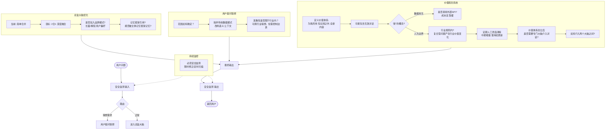

```mermaid
flowchart TD
    Start([用户问题]) --> SafetyIn[安全监测 输入]
    SafetyIn --> Route{路由}
    Route -->|联想需求| Associate[用户提问联想]
    Route -->|正常| Direct[进入总监大脑]

    subgraph AssociateBrain [用户提问联想]
        A1[范围如何确定？] --> A2[抛弃传统数据模式<br>改用语义/上下文]
        A2 --> A3[发散性是否限于行业内？<br>可跨行业联想，但需控制边界]
    end

    subgraph Director [总监大脑优化]
        D1[当前: 简单合并] --> D2[目标: 2合1 深度融合]
        D2 --> D3[是否加入品牌模式?<br>长篇/精短 用户偏好]
        D3 --> D4[记忆框架引用?<br>能否被主体记忆框架记忆?]
    end

    subgraph ValueSystem [价值观念系统]
        V1[定义价值体系:<br>为我所用 知识库之外 全新内容] --> V2[可能包含无效对话]
        V2 --> V3{“新”的概念?}
        V3 -->|数据库无| V4[是否调用外部API?<br>成本高 暂缓]
        V3 -->|人为边界| V5[行业规则内?<br>复合型问题产生行业价值变化]
        V5 --> V6[定期人工筛选清除<br>中期难做 需持续更新]
        V6 --> V7[价值体系创立后<br>是否需要专门大脑介入对话?]
        V7 --> V8[如何介入两个大脑之间?]
    end

    Director --> Output[最终输出]
    AssociateBrain --> Output
    ValueSystem --> Output

    Output --> SafetyOut[安全监测 输出]
    SafetyOut --> End([返回用户])

    subgraph Monitor [持续监控]
        M1[必须安全监测<br>随时修正/定时扫描]
    end

    Monitor -.-> SafetyIn
    Monitor -.-> SafetyOut
```