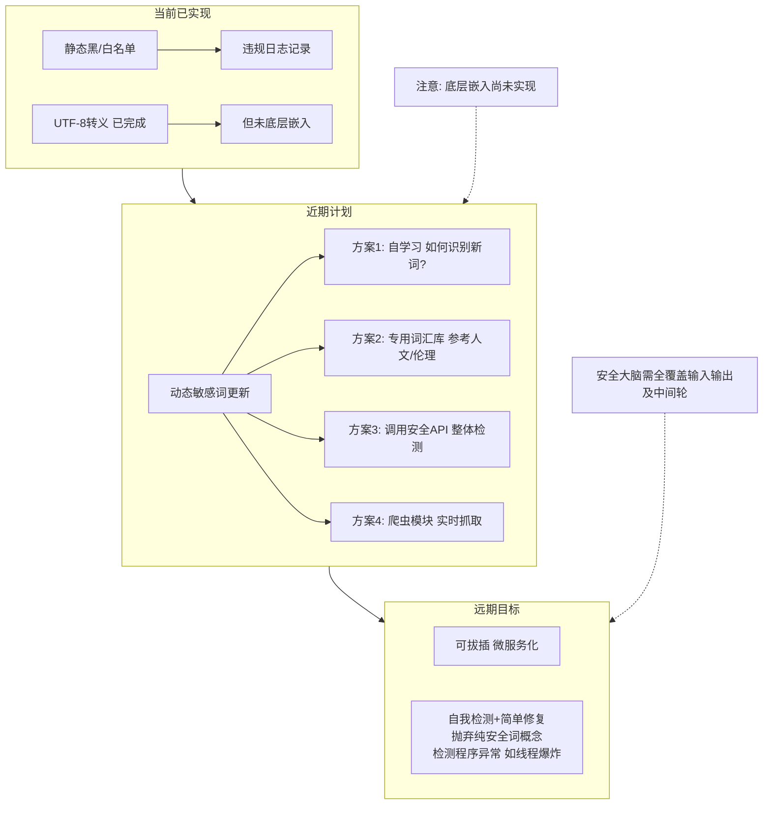

```mermaid
flowchart TD
    subgraph Current [当前已实现]
        A[静态黑/白名单] --> B[违规日志记录]
        C[UTF-8转义 已完成] --> D[但未底层嵌入]
    end

    subgraph ShortTerm [近期计划]
        E1[动态敏感词更新] --> E2[方案1: 自学习 如何识别新词?]
        E1 --> E3[方案2: 专用词汇库 参考人文/伦理]
        E1 --> E4[方案3: 调用安全API 整体检测]
        E1 --> E5[方案4: 爬虫模块 实时抓取]
    end

    subgraph LongTerm [远期目标]
        F[可拔插 微服务化]
        G[自我检测+简单修复<br>抛弃纯安全词概念<br>检测程序异常 如线程爆炸]
    end

    Current --> ShortTerm
    ShortTerm --> LongTerm

    Note1[注意: 底层嵌入尚未实现] -.-> ShortTerm
    Note2[安全大脑需全覆盖输入输出及中间轮] -.-> LongTerm
```